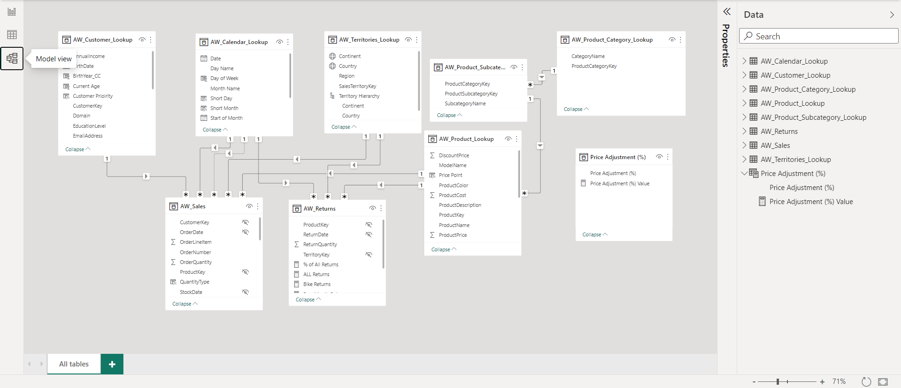

# Adventure_Works_Cycles_Power_BI_Project
End-to-end Business Intelligence Solution using Power BI

## Project Summary
This project is part of the Microsoft Power BI Desktop for Business Intelligence course created by Maven Analytics and available on Udemy. Microsoft created a sample OLTP database called the Adventure Works Database. It was made to help Adventure Works Cycles, a Fictitious global manufacturing firm. This fictitious company hired me to design and deliver an end-to-end business intelligence solution. The client needed a way to track KPIs (sales, revenue, profit, returns), compare regional performance, analyse product-level trends and forecasts, and identify high-value customers.
Using Power Query to link and alter the data, I transformed the fictitious company's data into a relational model. After that, I used data analysis expressions (or DAX) to create calculated columns and measures. In the end, I made an interactive report with three pages to show the company's performance using multiple visualisations.

### Relational Model

### Report

#### Executive Summary Page

#### Product Details Page

#### Customer Details Page
